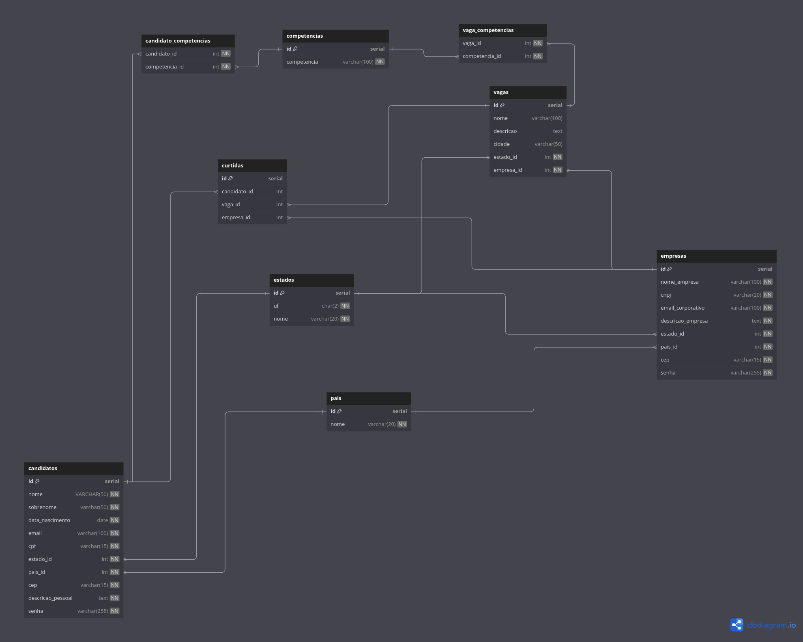

# Linketinder-Project
Repositório destinado ao Linketinder do programa AceleraZG
## Autor: Cassio Ferreira Rodrigues

### Como rodar Backend
***1. Instalação do Groovy*** 

Para ser feito a instalação do Groovy você pode baixar clicando [aqui](https://groovy.apache.org/download.html).

***2. Fazer o clone deste repositório:***
```bash
    git clone https://github.com/CassioFerreiraRod/Linketinder-Project.git
``` 

***3. Para excução***  

* Navegue para o diretório src/main/groovy
* Abra o terminal e digite o seguinte comando:
```shell
    groovy Main
```
### Como rodar Frontend
***1. Navegue até a pasta frontend*** 
```shell
   cd frontend
``` 
***2. Execute o build do programa*** 
```shell
   npm run build
``` 

### Tecnologias usadas
* [Groovy](http://www.groovy-lang.org)
* [NodeJS](https://nodejs.org/en)
* [WebPack](https://webpack.js.org)
* [HTML](https://developer.mozilla.org/pt-BR/docs/Web/HTML)
* [CSS](https://developer.mozilla.org/pt-BR/docs/Learn/Getting_started_with_the_web/CSS_basics)
* [Bootstrap](https://getbootstrap.com)
* [Gradle](https://gradle.org/)

### Banco de dados
DER Do banco de dados:

O arquivo sql onde foi fei gerado o banco de dados encontra [aqui](postgresql/linketinder_postgres.sql)
### Tecnologias usadas
* [PostegreSQL](https://www.postgresql.org/) para o SGBD
* [dbdiagram.io](https://dbdiagram.io/home) para o DER (Diagrama de Entidade-Relacionameto)
