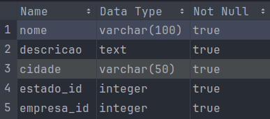
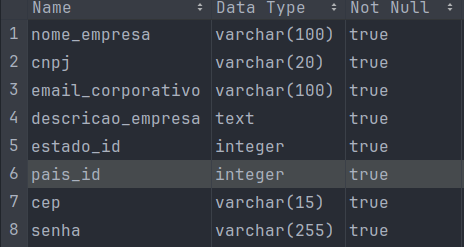

# Documentação REST
## Visão Geral
Esta API permite fazer a persistência informações sobre vagas de emprego, empresas e candidatos no banco de dados.
## Tecnologias usadas
* [Tomcat](https://tomcat.apache.org/)
* [Jersey](https://eclipse-ee4j.github.io/jersey/)
## Endpoints
### Criar Vaga (POST)
Cria uma nova vaga.

#### URL
```http request
    http://localhost:8080/linketinder/usuario/empresas/vagas
```

#### Parâmetros de Solicitação



#### Exemplo de Corpo de Solicitação
```json
{
  "nome": "Analista de Requisitps",
  "descricao": "Buscamos um analista de requistos para fazer parte da nossa equipe.",
  "cidade": "São Paulo",
  "estado": "São Paulo",
  "empresa": "Mega Soluções LTDA",
  "competencias": ["Java", "Groovy"]
}
```
#### Exemplo de resposta
```json
{
  "status": 201,
  "mensagem": "Cadastro feito com sucesso"
}
```
### Criar Empresa (POST)
Cria uma nova empresa.

#### URL
```http request
    http://localhost:8080/linketinder/usuario/empresas
```

#### Parâmetros de Solicitação



#### Exemplo de Corpo de Solicitação
```json
{
  "nome": "Mega Soluções LTDA",
  "email":"megasolucoes@contato.com",
  "cnpj":"42.538.044/0001-46",
  "cep": "95175-896",
  "estado": "São Paulo",
  "pais": "Brasil",
  "descricao": "Trazendo mega soluções",
  "senha": "454848461"
}
```
#### Exemplo de resposta
```json
{
  "status": 201,
  "mensagem": "Cadastro feito com sucesso"
}
```